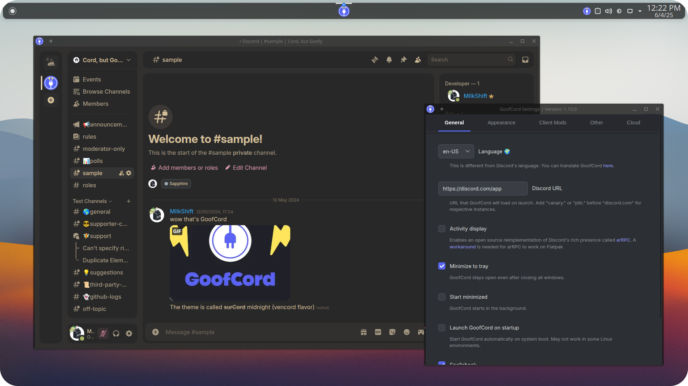

<h2>Take control of your Discord experience with GoofCord – the highly configurable and privacy-focused Discord client. Based on <a href="https://github.com/ArmCord/ArmCord">ArmCord</a>.</h2>

 

## Features :sparkles:
- **:lock: With Privacy in mind**: GoofCord blocks all tracking and uses multiple techniques like message encryption to improve your privacy and security. [Learn more](https://github.com/Milkshiift/GoofCord/wiki/Privacy-FAQ)
- **:gear: Your Way, Your Client**: Set up GoofCord to your liking with an array of customization options.
- **:chart_with_upwards_trend: Fast and Performant**: Glide through your chats with GoofCord's superior speed and responsiveness compared to the official client. 
- **:bookmark: Standalone**: GoofCord is a standalone client, not reliant on the original Discord client in any way.
- **:electric_plug: Plugins & Themes support**: Easily use client mods like [Vencord](https://github.com/Vendicated/Vencord) or [Shelter](https://github.com/uwu/shelter) for a world of plugins and themes.
- **🐧 Linux support**: Seamless screensharing with audio and native Wayland support on Linux. See FAQ for details.

## Ready to Dive In?
### Windows 🪟

* **Windows 7/8:** Use [this](https://github.com/Alex313031/GoofCord-Win7) fork.
* Install with prebuilt binaries from the [releases](https://github.com/Milkshiift/GoofCord/releases/latest) page.    
Choose `GoofCord-Setup-<YOUR ARCHITECTURE>.exe` for an installer, or    
`GoofCord-<VERSION>-win-<YOUR ARCHITECTURE>.zip` to manually unpack into a directory of your choice.
* Install using **winget**: `winget install GoofCord`

### Linux 🐧

* Install with prebuilt binaries from the [releases](https://github.com/Milkshiift/GoofCord/releases/latest) page.
* Install from [Flathub](https://flathub.org/apps/io.github.milkshiift.GoofCord)
* Install from [AUR](https://aur.archlinux.org/packages/goofcord-bin) if you run an **Arch**-based OS. Here's an example using pacman:    
`sudo pacman -S goofcord-bin`    
Keep in mind that the AUR package is not maintained by the developers of GoofCord.
* Install in **NixOS** system-wide by adding ``pkgs.goofcord`` to ``environment.systemPackages``     
Testing in a temporary shell can also be done using ``nix shell nixpkgs#goofcord``

### macOS 🍏

* Install with prebuilt binaries from the [releases](https://github.com/Milkshiift/GoofCord/releases/latest) page.    
Choose the file ending with `mac-arm64.dmg` if your computer uses an Apple Silicon processor. [Mac computers with Apple Silicon](https://support.apple.com/en-us/HT211814)      
Otherwise, choose the file that ends with `mac-x64.dmg`
* If you get an error like "GoofCord is damaged and can't be opened" see [this issue](https://github.com/Milkshiift/GoofCord/issues/7)

See FAQ for ways to open GoofCord's settings.    
To explore plugins and themes, head over to the Vencord category in the Discord settings.    
Have fun!
    
And if you want to compile it yourself, here's how:
1. Install [Node.js](https://nodejs.dev) and [pnpm](https://pnpm.io/installation#using-npm)
2. Grab the source code from the latest release. Getting it from the main branch is not recommended for a stable experience.
3. Open a command line in the directory of the source code
4. Install the dependencies with `pnpm install`
5. Package GoofCord with `pnpm run packageWindows` or `pnpm run packageLinux`
6. Find your freshly compiled app in the `dist` folder.

## Short FAQ
### Where is the long FAQ?
- [On the Wiki](https://github.com/Milkshiift/GoofCord/wiki/FAQ)

### Need Support? Join Our Discord!

### Can I get banned from using GoofCord? 🤔
- While using GoofCord goes against [Discord ToS](https://discord.com/terms#software-in-discord%E2%80%99s-services), no one has ever been banned from using it or any client mods.

### How can I access the settings? ⚙️
- Multiple ways:
  - Right-click on the tray icon and click `Open Settings`
  - Click the "Settings" button in the "GoofCord" category in the Discord settings
  - Press `Ctrl+Shift+'` shortcut.

### How do I run GoofCord natively on Wayland?
- GoofCord should run natively out of the box, but if it doesn't, run with these flags:    
`--enable-features=UseOzonePlatform,WaylandWindowDecorations --ozone-platform-hint=auto`    
If GoofCord shows a black screen, also include this flag: `--disable-gpu-sandbox`

### How do I stream with audio on Linux?
- If you use PulseAudio it should work out of the box. For PipeWire you will need to install pipewire-pulse if it's not already installed

### Seeking the Source Code? 🕵️‍♂️
- You can find our source code on [GitHub](https://github.com/Milkshiift/GoofCord/).

### Check out our [wiki](https://github.com/Milkshiift/GoofCord/wiki) if you've got questions left

## Credits 🙌

[ArmCord](https://github.com/ArmCord/ArmCord)  
[Discord Sandboxed](https://github.com/khlam/discord-sandboxed)  
[Vencord](https://github.com/Vendicated/Vencord)     
[Vesktop](https://github.com/Vencord/Vesktop)    
[WebCord](https://github.com/SpacingBat3/WebCord)
